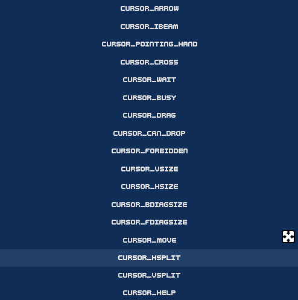

# Awesome Custom Cursor


<!-- Place this tag where you want the button to render. -->
 

## Features

* A ready to use cursor with animation support



## How it works

This addon creates an AnimatedSprite2D and projects the current frame texture into the mouse. Making a "Native" cursor.

You can modify the AnimatedSprite2D to change the images as you like.

If for some reason you want to have all 17 cursor shapes and new ones, I would send you to the version 1.x where instead of a native mouse its an AnimatedSprite2D following your mouse.

[You can read all about it here](https://github.com/DaviD4Chirino/awesome-custom-cursor/tree/28efb60a21193f060292884ea5407c6e5c76c0cd)

Or go the downloads section and [download the latest v1](https://github.com/DaviD4Chirino/awesome-custom-cursor/releases/tag/1.0.1), the installation is the same for all versions.

## Installation

Go to asset tab in your project and search for Awesome Scene Manager and install from there.

You can also get the same files from [GodotAssetStore](https://godotengine.org/asset-library/asset/2949)

Or

Go to the release page and grab the latest version, decompress the files in your addons folder (create one if theres none).

## Usage

After installation, it will add an autoload called **Cursor**.

Once enabled, thats it, no more configuration needed, see [sprites and animations](#sprites-and-animations) for customization.

### The Cursor Scene


As you can see the cursor scene is a simple **Node2D** with an **CanvasLayer** and inside theres a **AnimatedSprite2D** called **Sprite** as his only child.

The canvas layer is there because some popups appears above the sprite, thats why it has the highest layer possible.

### Properties

| Type | Name |
| -------- | -   |
| Shapes | [CursorShape](#shape) |

#### shape

This handles a custom Enum called Shapes, this enum is basically [Input.CursorShape](https://docs.godotengine.org/en/stable/classes/class_input.html#enum-input-cursorshape), I recreated it here because these built-in Enums cannot be iterated trough.

You can use like so:

```GDScript
for cursor_shape in Cursor.Shapes:
 prints(Cursor.Shapes.keys().find(cursor_shape), cursor_shape)

## logs: 
# 0 CURSOR_ARROW
# 1 CURSOR_IBEAM
# 2 CURSOR_POINTING_HAND
# 3 CURSOR_CROSS
# 4 CURSOR_WAIT
# 5 CURSOR_BUSY
# 6 CURSOR_DRAG
# 7 CURSOR_CAN_DROP
# 8 CURSOR_FORBIDDEN
# 9 CURSOR_VSIZE
# 10 CURSOR_HSIZE
# 11 CURSOR_BDIAGSIZE
# 12 CURSOR_FDIAGSIZE
# 13 CURSOR_MOVE
# 14 CURSOR_HSPLIT
# 15 CURSOR_VSPLIT
# 16 CURSOR_HELP
```

### Sprites and Animations

Taking the name of the shape, it will search for an animation with the same name without the **CURSOR_** and lowercase. Following the previous example;

With a shape of `Cursor.Shapes.CURSOR_BUSY` it will search for an animation called `busy` in the **AnimatedSprite2D**


`Cursor.Shapes.CURSOR_ARROW` becomes simply `arrow`
`Cursor.Shapes.CURSOR_POINTING_HAND` becomes `pointing_hand`
and so on and so forth

You could also use the function `get_shape_name` that returns a StringName of the current name of shape to search for the animation.
